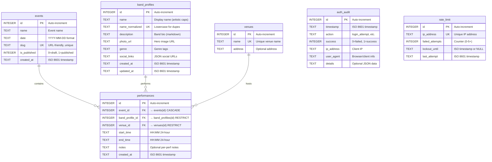

# Database Schema Documentation

**Database:** SetTimes
**Type:** SQLite (Cloudflare D1)
**Version:** 2.0 (Band Profile System)
**Last Updated:** 2025-10-25

## Overview

The SetTimes database supports **multi-event management** with a **band profile system** that separates band identity (reusable across events) from performance scheduling (event-specific).

## Source of Truth

- **Canonical schema:** `database/schema-final.sql`
- **Active migrations:** `migrations/`
- **Legacy migrations:** `migrations/legacy/` (kept for historical reference only; do not add new migrations here)

### Key Features

- **Band Library:** Reusable band profiles with photos, bios, and social links
- **Smart Duplicate Detection:** Prevents accidental duplication while preserving artistic capitalization
- **Multi-Event Support:** Same bands can perform across multiple events (Vol. 5, Vol. 6, etc.)
- **Shared Venues:** Venue information reused across all events
- **Security:** Authentication audit logging and IP-based rate limiting
- **Publication Workflow:** Draft → published with granular control

## Entity Relationship Diagram



## Band Profile System Architecture

### Why This Design?

**Problem:** The old schema duplicated band data for each event. If "The Harpoonist" played Vol. 5, Vol. 6, and Vol. 7, their name and URL were stored three times. Updating the band's website meant editing three rows.

**Solution:** Separate band identity (profile) from performance scheduling:

- **`band_profiles`:** Who the band is (name, bio, photos, social links)
- **performances`:** When/where they played (event, venue, time)

**Benefits:**

1. Update band info once → reflects across all events
2. See complete performance history per band
3. Build searchable band library for reuse
4. Enable future features (Bandcamp integration, discovery platform)

### Smart Duplicate Detection

**Challenge:** Prevent duplicates like "The Harpoonist" vs "THE HARPOONIST" while preserving artistic capitalization like "mxmtoon", "CHVRCHES", "deadmau5".

**Solution:** Two-field approach:

- `name`: Display name (preserves user input exactly)
- `name_normalized`: Lowercase + trimmed for duplicate checking (UNIQUE constraint)

**Normalization Rules:**

```javascript
// Convert to lowercase, trim, collapse multiple spaces
const normalized = name.toLowerCase().trim().replace(/\s+/g, ' ');

// Examples:
"The Harpoonist"  → "the harpoonist"
"THE HARPOONIST"  → "the harpoonist"  // Duplicate detected!
"The  Harpoonist" → "the harpoonist"  // Double space caught
"mxmtoon"         → "mxmtoon"         // Artistic caps preserved
"CHVRCHES"        → "chvrches"        // Stored as "CHVRCHES", normalized for lookup
```

**User Experience:**
When creating a band that matches an existing normalized name:

1. API returns 409 Conflict
2. Frontend shows: "⚠️ Similar band found: The Harpoonist (played Vol. 5, Vol. 4)"
3. User chooses: [Use This Band] or [Create Different Band]
4. "Create Different Band" requires distinguishing detail (e.g., "The Harpoonist (Tribute)")

### Migration from v1

See `migrations/legacy/migration-v1-to-v2.sql` for complete migration script.

**Summary:**

1. Extract unique bands from old `bands` table using normalization
2. Create `band_profiles` with deduplication
3. Create `performances` linking to profiles
4. Archive old `bands` table as `bands_deprecated_v1`

## Table Details

### `events`

Stores each band crawl event (e.g., Vol. 5, Vol. 6).

| Column         | Type    | Constraints                | Description                                           |
| -------------- | ------- | -------------------------- | ----------------------------------------------------- |
| `id`           | INTEGER | PRIMARY KEY, AUTOINCREMENT | Unique event identifier                               |
| `name`         | TEXT    | NOT NULL                   | Display name (e.g., "Long Weekend Band Crawl Vol. 5") |
| `date`         | TEXT    | NOT NULL                   | Event date in YYYY-MM-DD format                       |
| `slug`         | TEXT    | NOT NULL, UNIQUE           | URL-friendly identifier (e.g., "vol-5", "vol-6")      |
| `is_published` | INTEGER | NOT NULL, DEFAULT 0        | Publication status: 0 = draft, 1 = published          |
| `created_at`   | TEXT    | NOT NULL, DEFAULT now()    | ISO 8601 creation timestamp                           |

**Business Rules:**

- `slug` must be lowercase, numbers, and hyphens only (validated at application layer)
- Only published events (`is_published = 1`) are visible in public API
- Deleting an event cascades to all associated bands

**Indexes:**

- `idx_events_published` on `is_published` - Fast filtering of published events
- `idx_events_slug` on `slug` - Fast lookups for public schedule API

### `venues`

Stores venue information shared across all events.

| Column    | Type    | Constraints                | Description                                  |
| --------- | ------- | -------------------------- | -------------------------------------------- |
| `id`      | INTEGER | PRIMARY KEY, AUTOINCREMENT | Unique venue identifier                      |
| `name`    | TEXT    | NOT NULL, UNIQUE           | Venue name (e.g., "Room 47", "The Basement") |
| `address` | TEXT    | NULL                       | Optional physical address                    |

**Business Rules:**

- Venue names must be unique across all events
- Venues can be reused across multiple events (e.g., "Room 47" in Vol. 5 and Vol. 6)
- Deleting a venue is RESTRICTED if bands are scheduled there

**Design Decision:**
Venues are shared across events (not event-specific) because:

- Same physical venues are typically used year after year
- Reduces data duplication
- Simplifies venue management in admin panel

### `band_profiles`

Stores reusable band identity across all events. This is the "band library."

| Column            | Type    | Constraints                | Description                                            |
| ----------------- | ------- | -------------------------- | ------------------------------------------------------ |
| `id`              | INTEGER | PRIMARY KEY, AUTOINCREMENT | Unique band profile identifier                         |
| `name`            | TEXT    | NOT NULL                   | Display name (preserves artistic capitalization)       |
| `name_normalized` | TEXT    | NOT NULL, UNIQUE           | Lowercase + trimmed for duplicate detection            |
| `description`     | TEXT    | NULL                       | Band bio/description (markdown supported)              |
| `photo_url`       | TEXT    | NULL                       | Hero image URL (uploaded or external link)             |
| `genre`           | TEXT    | NULL                       | Genre tags (comma-separated for MVP)                   |
| `social_links`    | TEXT    | NULL                       | JSON: {"bandcamp": "url", "instagram": "@handle", ...} |
| `created_at`      | TEXT    | NOT NULL, DEFAULT now()    | ISO 8601 creation timestamp                            |
| `updated_at`      | TEXT    | NOT NULL, DEFAULT now()    | ISO 8601 last update timestamp                         |

**Business Rules:**

- `name_normalized` enforces duplicate detection (see normalization rules above)
- Artistic capitalization preserved in `name` field ("mxmtoon", "CHVRCHES")
- `social_links` stores flexible JSON for any platform (Bandcamp, Instagram, Facebook, Spotify, YouTube, etc.)
- Cannot delete if performances exist (FK RESTRICT)
- Auto-updates `updated_at` on any edit (via trigger)

**Indexes:**

- `idx_band_profiles_normalized` on `name_normalized` (UNIQUE) - Fast duplicate detection
- `idx_band_profiles_name` on `name` - Fast autocomplete search
- `idx_band_profiles_genre` on `genre` - Fast filtering by genre

### `performances`

Links band profiles to events with scheduling details. Replaces old `bands` table.

| Column            | Type    | Constraints                      | Description                                           |
| ----------------- | ------- | -------------------------------- | ----------------------------------------------------- |
| `id`              | INTEGER | PRIMARY KEY, AUTOINCREMENT       | Unique performance identifier                         |
| `event_id`        | INTEGER | NOT NULL, FK → events(id)        | Event this performance belongs to                     |
| `band_profile_id` | INTEGER | NOT NULL, FK → band_profiles(id) | Which band is performing                              |
| `venue_id`        | INTEGER | NOT NULL, FK → venues(id)        | Venue where band performs                             |
| `start_time`      | TEXT    | NOT NULL                         | Performance start time (HH:MM, 24-hour)               |
| `end_time`        | TEXT    | NOT NULL                         | Performance end time (HH:MM, 24-hour)                 |
| `notes`           | TEXT    | NULL                             | Optional per-performance notes (e.g., "acoustic set") |
| `created_at`      | TEXT    | NOT NULL, DEFAULT now()          | ISO 8601 creation timestamp                           |

**Foreign Keys:**

- `event_id → events(id) ON DELETE CASCADE` - Deleting event removes performances
- `band_profile_id → band_profiles(id) ON DELETE RESTRICT` - Cannot delete band if they have performances
- `venue_id → venues(id) ON DELETE RESTRICT` - Cannot delete venue if performances scheduled

**Business Rules:**

- `end_time` must be after `start_time` (validated at application layer)
- Conflict detection warns when performances overlap at same venue
- Times are stored in 24-hour HH:MM format (e.g., "20:00", "21:30")
- Same band can perform at multiple events (that's the point!)

**Indexes:**

- `idx_performances_event` on `event_id` - Fast filtering by event
- `idx_performances_band` on `band_profile_id` - Fast performance history queries
- `idx_performances_venue` on `venue_id` - Fast conflict detection
- `idx_performances_event_time` on `(event_id, start_time)` - Fast sorted queries

### `auth_audit`

Logs all authentication attempts for security monitoring and forensics.

| Column       | Type    | Constraints                | Description                                           |
| ------------ | ------- | -------------------------- | ----------------------------------------------------- |
| `id`         | INTEGER | PRIMARY KEY, AUTOINCREMENT | Unique audit log identifier                           |
| `timestamp`  | TEXT    | NOT NULL, DEFAULT now()    | ISO 8601 timestamp of attempt                         |
| `action`     | TEXT    | NOT NULL                   | Action type (e.g., "login_attempt", "password_reset") |
| `success`    | INTEGER | NOT NULL                   | 0 = failed, 1 = successful                            |
| `ip_address` | TEXT    | NOT NULL                   | Client IP address (from CF-Connecting-IP header)      |
| `user_agent` | TEXT    | NULL                       | Browser/client user agent string                      |
| `details`    | TEXT    | NULL                       | Optional JSON with additional context                 |

**Business Rules:**

- Every authentication attempt is logged (success and failure)
- IP addresses are captured from Cloudflare's `CF-Connecting-IP` header
- Audit logs are append-only (no updates or deletes in application logic)
- Useful for security investigations and compliance

**Indexes:**

- `idx_auth_audit_timestamp` on `timestamp` - Fast time-based queries
- `idx_auth_audit_ip` on `ip_address` - Fast IP-based queries

**Query Examples:**

```sql
-- Failed login attempts in last 24 hours
SELECT * FROM auth_audit
WHERE action = 'login_attempt'
AND success = 0
AND timestamp > datetime('now', '-1 day')
ORDER BY timestamp DESC;

-- Suspicious activity from specific IP
SELECT * FROM auth_audit
WHERE ip_address = 'X.X.X.X'
ORDER BY timestamp DESC;
```

### `rate_limit`

Tracks failed login attempts and implements IP-based rate limiting.

| Column            | Type    | Constraints                | Description                                             |
| ----------------- | ------- | -------------------------- | ------------------------------------------------------- |
| `id`              | INTEGER | PRIMARY KEY, AUTOINCREMENT | Unique rate limit record identifier                     |
| `ip_address`      | TEXT    | NOT NULL, UNIQUE           | Client IP address                                       |
| `failed_attempts` | INTEGER | NOT NULL, DEFAULT 0        | Counter of failed login attempts                        |
| `lockout_until`   | TEXT    | NULL                       | ISO timestamp when lockout expires (NULL if not locked) |
| `last_attempt`    | TEXT    | NOT NULL, DEFAULT now()    | ISO 8601 timestamp of last attempt                      |

**Rate Limiting Algorithm:**

1. **Window:** 10 minutes (rolling)
2. **Threshold:** 5 failed attempts
3. **Lockout:** 1 hour

**Flow:**

```
Attempt 1-4: Increment counter, allow retry
Attempt 5:   Increment counter, set lockout_until = now + 1 hour
Locked:      Reject all attempts until lockout_until expires
Success:     Reset failed_attempts to 0, clear lockout_until
```

**Business Rules:**

- One row per IP address (UNIQUE constraint)
- Successful login resets the counter to 0
- Lockout period begins after 5th failed attempt
- Counter resets after 10 minutes of inactivity (checked at login time)

**Indexes:**

- `idx_rate_limit_ip` on `ip_address` - Fast lookups during login

**Query Examples:**

```sql
-- Currently locked-out IPs
SELECT ip_address, lockout_until, failed_attempts
FROM rate_limit
WHERE lockout_until IS NOT NULL
AND lockout_until > datetime('now');

-- Reset specific IP's lockout
UPDATE rate_limit
SET failed_attempts = 0,
    lockout_until = NULL
WHERE ip_address = 'X.X.X.X';
```

## Relationships

### One-to-Many Relationships

#### `events` → `bands` (1:N)

- **Cardinality:** One event has many bands
- **Cascade Behavior:** `ON DELETE CASCADE`
- **Rationale:** When an event is deleted, all associated band performances should be removed

Example:

```
events (id=1, name="Vol. 5")
  └─ bands (id=1, event_id=1, name="The Strokes")
  └─ bands (id=2, event_id=1, name="Arctic Monkeys")
  └─ bands (id=3, event_id=1, name="The Black Keys")
```

#### `venues` → `bands` (1:N)

- **Cardinality:** One venue hosts many bands (across all events)
- **Cascade Behavior:** `ON DELETE RESTRICT`
- **Rationale:** Cannot delete a venue if bands are scheduled there (data integrity protection)

Example:

```
venues (id=1, name="Room 47")
  └─ bands (id=1, venue_id=1, name="The Strokes", event_id=1)
  └─ bands (id=5, venue_id=1, name="LCD Soundsystem", event_id=2)
```

### Many-to-Many Relationship (Implicit)

#### `events` ↔ `venues` (M:N via `bands`)

Events and venues have an implicit many-to-many relationship through the `bands` junction table:

- One event can use multiple venues
- One venue can be used by multiple events
- The `bands` table acts as the junction table

Example:

```
Event "Vol. 5" uses venues: Room 47, The Basement, Exit/In
Event "Vol. 6" uses venues: Room 47, The Basement, Marathon Music Works
Venue "Room 47" is used by events: Vol. 5, Vol. 6
```

## Indexes and Performance

### Query Optimization Strategy

The database uses 8 strategic indexes to optimize common queries:

#### Events Queries

```sql
-- Fast: Uses idx_events_slug
SELECT * FROM events WHERE slug = 'vol-5';

-- Fast: Uses idx_events_published
SELECT * FROM events WHERE is_published = 1;
```

#### Bands Queries

```sql
-- Fast: Uses idx_bands_event
SELECT * FROM bands WHERE event_id = 1;

-- Fast: Uses idx_bands_event_time
SELECT * FROM bands
WHERE event_id = 1
ORDER BY start_time ASC;

-- Fast: Uses idx_bands_venue (for conflict detection)
SELECT * FROM bands
WHERE venue_id = 1
AND start_time < '21:00'
AND end_time > '20:00';
```

#### Security Queries

```sql
-- Fast: Uses idx_rate_limit_ip
SELECT * FROM rate_limit WHERE ip_address = 'X.X.X.X';

-- Fast: Uses idx_auth_audit_timestamp
SELECT * FROM auth_audit
WHERE timestamp > datetime('now', '-1 day');
```

### Index Size Considerations

- **Small Dataset:** Current indexes are lightweight (< 1KB each)
- **Scalability:** Effective for databases with thousands of bands per event
- **Composite Index:** `idx_bands_event_time` eliminates need for separate sort operation

## Database Constraints

### Primary Keys

All tables use `INTEGER PRIMARY KEY AUTOINCREMENT` for:

- Guaranteed uniqueness
- Efficient joins
- Automatic row ID generation

### Unique Constraints

- `events.slug` - Ensures URL-friendly identifiers are unique
- `venues.name` - Prevents duplicate venue names
- `rate_limit.ip_address` - One rate limit record per IP

### Foreign Key Constraints

- **CASCADE:** Deleting events removes associated bands
- **RESTRICT:** Cannot delete venues with scheduled bands

### NOT NULL Constraints

Applied to all essential fields to enforce data integrity at database level.

## Data Types and Formats

### TEXT Fields

| Field Type | Format     | Example                | Validation                            |
| ---------- | ---------- | ---------------------- | ------------------------------------- |
| Date       | YYYY-MM-DD | "2025-06-14"           | Regex: `^\d{4}-\d{2}-\d{2}$`          |
| Time       | HH:MM      | "20:00", "21:30"       | Regex: `^([01]\d\|2[0-3]):([0-5]\d)$` |
| Timestamp  | ISO 8601   | "2025-01-15T10:30:00Z" | SQLite datetime('now')                |
| Slug       | kebab-case | "vol-5", "lwbc-2024"   | Regex: `^[a-z0-9-]+$`                 |
| URL        | HTTP/HTTPS | "https://band.com"     | Optional, max 500 chars               |

### INTEGER Fields

| Field             | Range  | Usage                                     |
| ----------------- | ------ | ----------------------------------------- |
| `is_published`    | 0 or 1 | Boolean flag (0 = draft, 1 = published)   |
| `success`         | 0 or 1 | Boolean flag (0 = failed, 1 = successful) |
| `failed_attempts` | 0-5+   | Counter (5+ triggers lockout)             |

## Common Query Patterns

### Public API: Get Current Event Schedule

```sql
-- Step 1: Find current event
SELECT * FROM events
WHERE is_published = 1
ORDER BY date DESC
LIMIT 1;

-- Step 2: Get all bands for event (with venue names)
SELECT
  b.id,
  b.name,
  b.start_time,
  b.end_time,
  b.url,
  v.name AS venue_name,
  e.date AS event_date
FROM bands b
JOIN venues v ON b.venue_id = v.id
JOIN events e ON b.event_id = e.id
WHERE b.event_id = ?
ORDER BY b.start_time ASC;
```

### Admin: Conflict Detection

```sql
-- Check for overlapping bands at same venue
SELECT * FROM bands
WHERE venue_id = ?
AND event_id = ?
AND id != ? -- Exclude current band (for updates)
AND (
  (start_time < ? AND end_time > ?) -- Current band overlaps existing
  OR (start_time < ? AND end_time > ?) -- Existing overlaps current
);

-- Algorithm: (startA < endB) AND (endA > startB)
-- Example: Band A (20:00-21:00), Band B (20:30-21:30)
-- (20:00 < 21:30) AND (21:00 > 20:30) = TRUE (conflict!)
```

### Admin: Event Management Dashboard

```sql
-- Get all events with band counts
SELECT
  e.*,
  COUNT(b.id) AS band_count
FROM events e
LEFT JOIN bands b ON e.id = b.event_id
GROUP BY e.id
ORDER BY e.date DESC;
```

### Security: Rate Limit Check

```sql
-- Get rate limit record for IP
SELECT * FROM rate_limit
WHERE ip_address = ?;

-- If locked out, check if lockout expired
-- lockout_until > datetime('now') → still locked
-- lockout_until <= datetime('now') → lockout expired

-- Update after failed attempt
UPDATE rate_limit
SET failed_attempts = failed_attempts + 1,
    last_attempt = datetime('now'),
    lockout_until = CASE
      WHEN failed_attempts >= 4 THEN datetime('now', '+1 hour')
      ELSE lockout_until
    END
WHERE ip_address = ?;
```

## Migration Strategy

### Initial Setup

```bash
# Apply schema to D1 database
npx wrangler d1 execute settimes-db --file=database/schema.sql --local
npx wrangler d1 execute settimes-db --file=database/schema.sql --remote
```

### Future Migrations

For schema changes, create timestamped migration files:

```bash
migrations/legacy/
  001_initial_schema.sql           # Current schema
  002_add_band_genre.sql           # Future: Add genre field
  003_add_event_description.sql    # Future: Add event description
```

**Migration Pattern:**

```sql
-- 002_add_band_genre.sql
ALTER TABLE bands ADD COLUMN genre TEXT;
CREATE INDEX idx_bands_genre ON bands(genre);
```

### One-Off Ops Migrations

If a production database still has legacy `schedule_builds.band_id`, use the one-time script to rename it to `performance_id`:

```bash
# Only run if PRAGMA table_info(schedule_builds) shows band_id and no performance_id.
npx wrangler d1 execute settimes-db --file=scripts/migrate-schedule-builds-performance-id.sql --remote
```

### Data Seeding

For testing/development:

```bash
# Use provided migration script
node database/migrate-bands-json.js
```

## Security Considerations

### Rate Limiting

- **IP-based tracking:** Uses Cloudflare's `CF-Connecting-IP` header
- **Window:** 10-minute rolling window
- **Threshold:** 5 failed attempts → 1-hour lockout
- **Reset:** Successful login clears counter

### Audit Logging

- **Immutable logs:** No application-level updates or deletes
- **Comprehensive tracking:** All auth attempts logged
- **Forensics support:** Timestamp and IP for investigation

### Data Protection

- **No passwords stored:** Admin password in environment variable only
- **No PII in logs:** User agent is optional, no sensitive data
- **Cascade protection:** Venue deletion restricted if bands scheduled

## Best Practices

### When Creating Events

1. Choose a descriptive name (e.g., "Long Weekend Band Crawl Vol. 5")
2. Use consistent slug format (e.g., "vol-5", "vol-6")
3. Start as draft (`is_published = 0`)
4. Add venues before adding bands
5. Publish when ready (`is_published = 1`)

### When Scheduling Bands

1. Verify venue exists and is correct
2. Use 24-hour time format (HH:MM)
3. Ensure end time > start time
4. Check for conflicts at same venue
5. Add URL for band website/social (optional but recommended)

### When Managing Venues

1. Use consistent naming (e.g., "Room 47" not "room 47" or "Room47")
2. Add address for attendee convenience
3. Verify no bands scheduled before deleting

### Database Maintenance

1. **Monitor audit logs:** Check for suspicious activity weekly
2. **Clean old logs:** Archive auth_audit older than 90 days
3. **Analyze conflicts:** Review band conflicts for scheduling improvements
4. **Backup regularly:** Export D1 data before major changes

## Future Enhancements

Potential schema extensions for future features:

### Priority 1: CSV Import/Export

- No schema changes required
- Application-level feature using existing tables

### Priority 2: Asset Management (R2)

```sql
ALTER TABLE events ADD COLUMN image_url TEXT;
ALTER TABLE venues ADD COLUMN image_url TEXT;
ALTER TABLE bands ADD COLUMN image_url TEXT;
```

### Priority 3: Analytics

```sql
CREATE TABLE band_selections (
  id INTEGER PRIMARY KEY AUTOINCREMENT,
  band_id INTEGER NOT NULL,
  selected_at TEXT NOT NULL DEFAULT (datetime('now')),
  FOREIGN KEY (band_id) REFERENCES bands(id) ON DELETE CASCADE
);

CREATE INDEX idx_selections_band ON band_selections(band_id);
CREATE INDEX idx_selections_timestamp ON band_selections(selected_at);
```

### Priority 4: Multi-Tenancy

```sql
CREATE TABLE organizations (
  id INTEGER PRIMARY KEY AUTOINCREMENT,
  name TEXT NOT NULL,
  slug TEXT NOT NULL UNIQUE,
  created_at TEXT NOT NULL DEFAULT (datetime('now'))
);

ALTER TABLE events ADD COLUMN org_id INTEGER REFERENCES organizations(id);
```

## References

- **Schema File:** `database/schema.sql`
- **API Documentation:** `docs/api-spec.yaml`
- **Backend Framework:** `docs/BACKEND_FRAMEWORK.md`
- **Implementation Roadmap:** `docs/IMPLEMENTATION_ROADMAP.md`
- **Cloudflare D1 Docs:** https://developers.cloudflare.com/d1/

---

**Last Updated:** 2025-10-25
**Schema Version:** 1.0
**Generated by:** `/sc:docs database --format mermaid`
